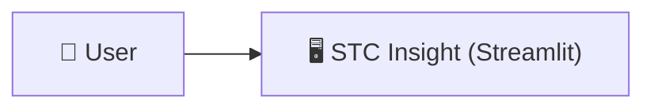
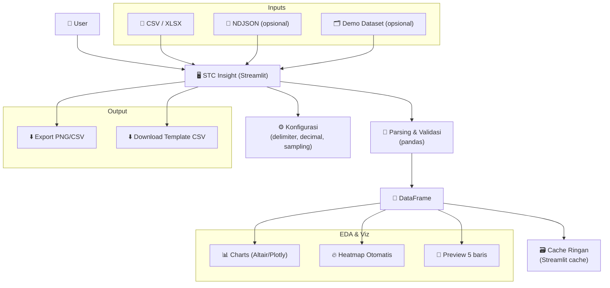
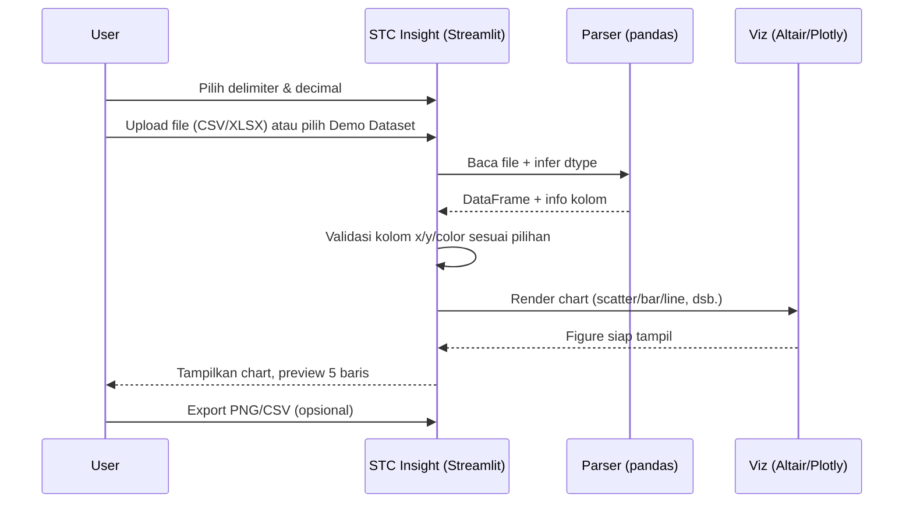
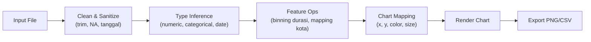

# 📊 Exploratory Data Analysis Dashboard

Visualisasi interaktif data pemesanan hotel berbasis **Streamlit** + **Plotly**.  
Dashboard ini dirancang untuk menyajikan **insight otomatis** dari data pemesanan hotel seperti durasi inap, total biaya, dan metode pembayaran — sebagai bagian dari **rangkaian riset integrasi smart contract dalam ekosistem pariwisata digital**.
 
[](https://doi.org/10.5281/zenodo.16763254)
[](https://stc-insight.streamlit.app/)


[](https://github.com/mrbrightsides/dashboard-EDA/actions/workflows/ping.yml)

---

## 🚀 Fitur Utama

- ✅ Dropdown variabel X/Y & kolom warna
- ✅ Scatter, Bar, Line, Box, Pie, Histogram, dan Heatmap
- ✅ Insight otomatis (mean, hotel favorit, total biaya tertinggi, dll)
- ✅ Checkbox Tabel Data
- ✅ Tombol Unduh Dataset (CSV)
- ✅ Debug Mode (opsional)

---

## 🪄 Alur Kerja



## High-level Architecture



---

## Sequence: Upload → Render Chart



---

## Data Pipeline Ringkas



---

## 📂 File Penting

- `app.py` — File utama Streamlit App
- `Dataset_Pemesanan_Hotel_1000Baris.csv` — Dataset sintetis (untuk simulasi)
- `requirements.txt` — Daftar dependensi untuk deploy

---

## ▶️ Jalankan Secara Lokal

```bash
# Install dependensi
pip install -r requirements.txt

# Jalankan Streamlit
streamlit run app.py
```

---

## 📜 Lisensi

MIT License © ELPEEF Dev Team
